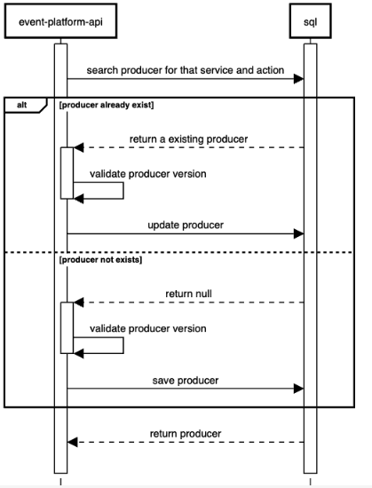
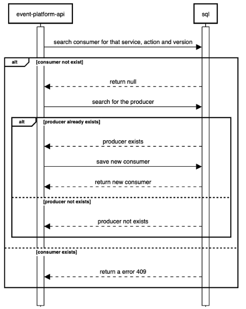
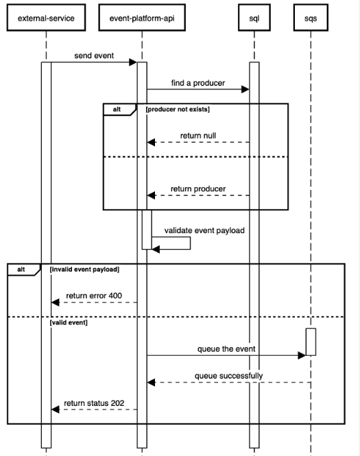
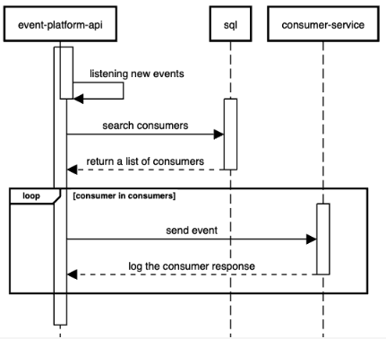

# Event Platform Api.

The application allows for the creation of two types of users: Producers and Consumers. Producers are the entities that create events. They have the ability to send events to the platform. On the other hand, Consumers, as the name suggests, are the entities that consume these events.

The application has 3 important contexts:

 - [Consumers](#consumers)
 - [Events](#events)
 - [Producers](#producers)

## Producers

Producers are the entities that create events. They have the ability to send events to the platform.

This sequence diagram represents the process of creating or updating a producer in the event platform API:

### Here's a simplified explanation:

1. The event platform API sends a request to the SQL database to search for a producer with a specific service and action.
2. If the producer already exists, the SQL database returns the existing producer to the event platform API. The event platform API then validates the producer version. If the validation is successful, the event platform API sends a request to the SQL database to update the producer.
3. If the producer does not exist, the SQL database returns null. The event platform API then validates the producer version. If the validation is successful, the event platform API sends a request to the SQL database to save the new producer.
4. After either creating a new producer or updating an existing one, the SQL database returns the producer to the event platform API.

## Consumers

Consumers are the entities that consume events. They can subscribe to events and receive them in real-time. Consumers can also view the events that they have subscribed to.

This sequence diagram represents the process of creating a consumer in the event platform API:

### Here's a simplified explanation:

1. The event platform API sends a request to the SQL database to search for a consumer with a specific service, action, and version.
2. If the consumer does not exist, the SQL database returns null. The event platform API then sends a request to the SQL database to search for the producer.
3. If the producer exists, the event platform API sends a request to the SQL database to save the new consumer. The SQL database then returns the new consumer.
4. If the producer does not exist, the SQL database returns a message indicating that the producer does not exist.
5. If the consumer already exists, the SQL database returns an error 409.

## Events

Events are the entities that are created by producers and consumed by consumers. Events have a name, a cersion, and a payload. The payload is a JSON object that can be used to store any data that the producer wants to send to the consumer.

The event flow has two steps, the first is validate and queue the event, and the second is to consume the events from the queue and send them to the consumers.

### Here's a simplified explanation of the first step:

1. The external service sends an event to the event platform API.
2. The event platform API sends a request to the SQL database to find a producer.
3. If the producer does not exist, the SQL database returns null.
4. If the producer exists, the SQL database returns the producer to the event platform API.
5. The event platform API then validates the event payload.
6. If the event payload is invalid, the event platform API returns an error 400 to the external service.
7. If the event payload is valid, the event platform API sends a request to the SQS to queue the event. The SQS then returns a message indicating that the event has been queued successfully.
8. The event platform API then returns a status 202 to the external service, indicating that the event has been accepted for processing.

### Here's a simplified explanation of the second step:

1. The event platform API starts listening for new events.
2. The event platform API sends a request to the SQL database to search for all consumers.
3. The SQL database returns a list of consumers to the event platform API.
4. For each consumer in the list of consumers, the event platform API sends the event to the consumer service.
5. The consumer service processes the event and returns a response, which the event platform API logs
